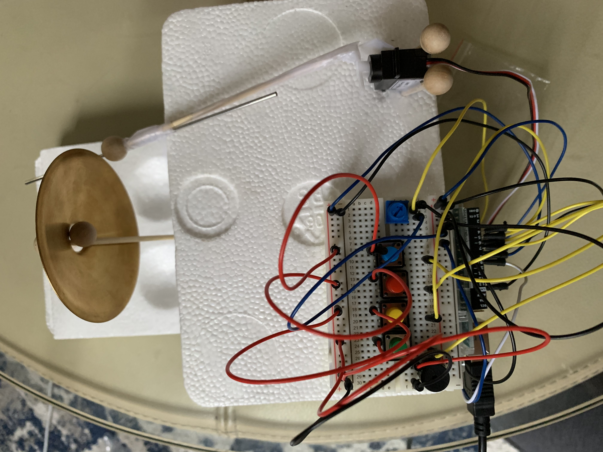
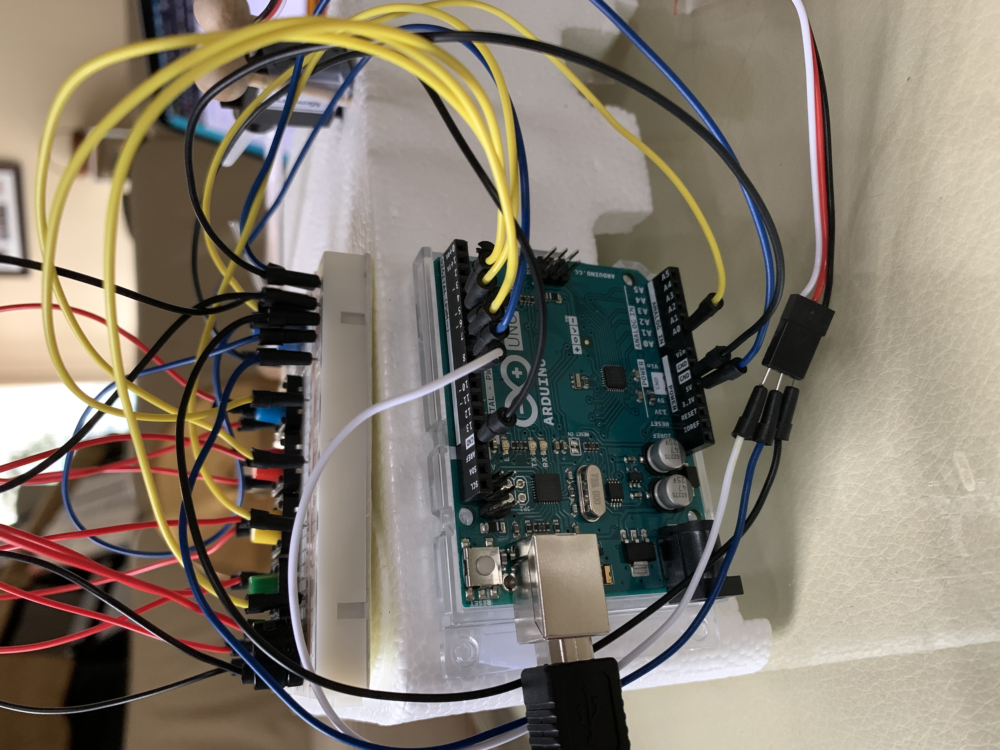

**Keys and Precussion**

This project consists of 4 buttons which make the music notes of G, A, B and D through the piezo buzzer. Accompanying the keys is a precussion instrument controlled by a potentiometer and servo. 

***Process:***
The process involved a lot of trial and error. As well as finding a system to avoid confusion from all the wires and connections being bundled together.
- While trying to adjust the buttons to play to notes I wanted, I learned that the frequency values were very sensitive and went up the musical scale. I had a lot of fun playing around with the numbers to find each note. 
- I spent a lot of time trying to figure out why my servo wouldn't move simultaneously with the key buttons functioning. In order for the servo to move, I had to connect the servo to a 5V pin. However once it was connected, the buttons would stop responding. After removing the wire from the 5V pin, the buttons would work but the servo wouldn't. I tried rearranging the wires so all buttons and the servo would be connected to the 5V pin but that also didn't seem the work. The buttons needed to be connected to a digital pin for power whereas the servo needed the 5V. I later found that by separating the buttons and the servo by having them connect in separate sides of the bread board worked. The buttons were all connected and powered by the digital pins and the servo separated, connected to the 5V pin. 
- Getting the buttons to work and play a note on the piezo buzzer was a challenge to me. In the beginning, the only sound which came out of the buzzer were soft and quick, clicking sounds. My program instructed the buzzer to play a determined frequency based on reading the button's value (if it was LOW or HIGH). I thought it would have to be HIGH in order for the button to play a key but I learned that it turns out the digitalRead of the buttons needed to be LOW for it to play a note. I'm not entirely sure why this is the case since we usually checked to see if the values were HIGH in class. I'm assuming that it has something to do with the way I connected everything on the bread board. Perhaps it has something to do with the absense of a resister or direct connection to ground. Every button was connected to a digital pin.
- I also initially had trouble trying to get the servo to rotate according to the potentiometer:[reference](https://create.arduino.cc/projecthub/Raushancpr/servo-motor-control-with-potentiometer-5d866f). I realized that in addition to maping the potentiometer values to the servo, adding a delay function to allow the servo some time to reach a certain point before changing its position again was needed. I set the delay to a really small number (15) to let it adjust quickly, it's barely noticeable. 
- A trick I learned while organizing the wires to prevent losing track of what they are connected to is to place a piece of tape on the wire I'm currently working with. It also prevents me from pulling out the wrong wire and having to look where to put it back. 

***Link to video:*** 
[instrument video](https://youtu.be/RgEzpMnkCD0) 

***Schematic:*** 

***Project Image:***

