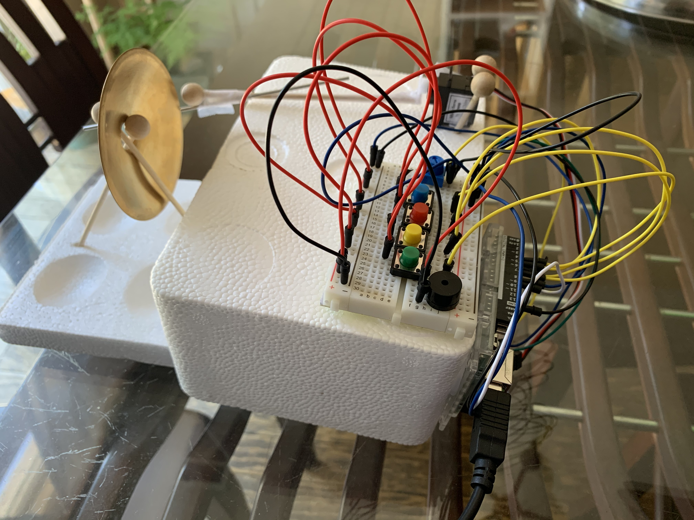
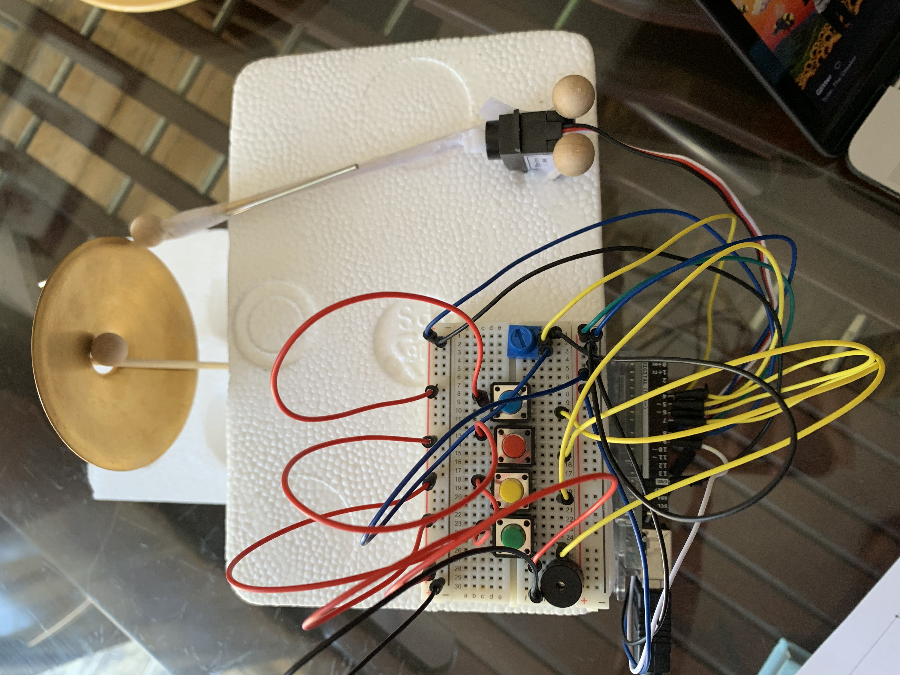
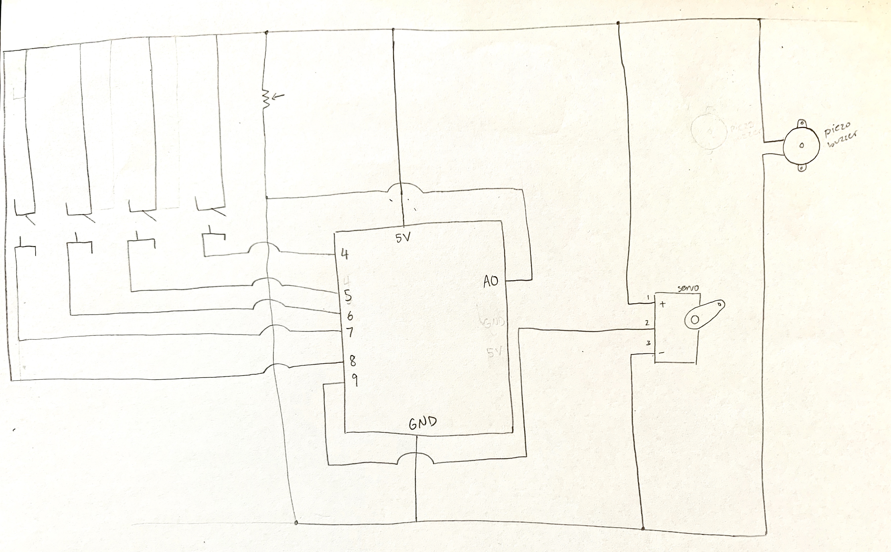

Document your project in a new folder called "27July_MusicalInstrument". Your documentation must include:
README.md with
Description of project
Anything clever or tricky
Problems (if any) and how you overcame them
Schematic
Link to short video of the instrument being played
Photograph of the instrument
Closeup photograph of the electronics

**Keys and Precussion**

This project consists of 4 buttons which make the music notes of G, A, B and D through the piezo buzzer. Accompanying the keys is a precussion instrument controlled by a potentiometer and servo. 

***Process:***
The process involved a lot of trial and error. As well as finding a system to avoid confusion from all the wires and connections being bundled together.
- While trying to adjust the buttons to play to notes I wanted, I learned that the frequency values were very sensitive and went up the musical scale. I had a lot of fun playing around with the numbers to find each note. 
- I spent a lot of time trying to figure out why my servo wouldn't move simultaneously with the key buttons. In order for the servo to move, I had to connect the servo to a 5V pin. However once it was connected, the buttons would stop responding. After removing the wire from the 5V pin, the buttons would work but the servo wouldn't. I tried rearranging the wires so all buttons and the servo would be connected to the 5V pin but that also didn't seem the work. The buttons needed to be connected to a digital pin for power whereas the servo needed the 5V. I later found that by separating the buttons and the servo by having them connect in separate sides of the bread board worked. The buttons were all connected and powered by the digital pins and the servo separated, connected to the 5V pin. 

***Project Image:***

***Link to video:*** 
[instrument video](https://youtu.be/RgEzpMnkCD0) 

***Schematic:*** 

