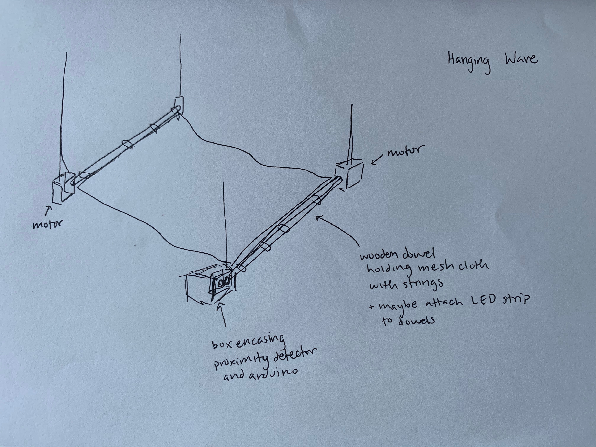
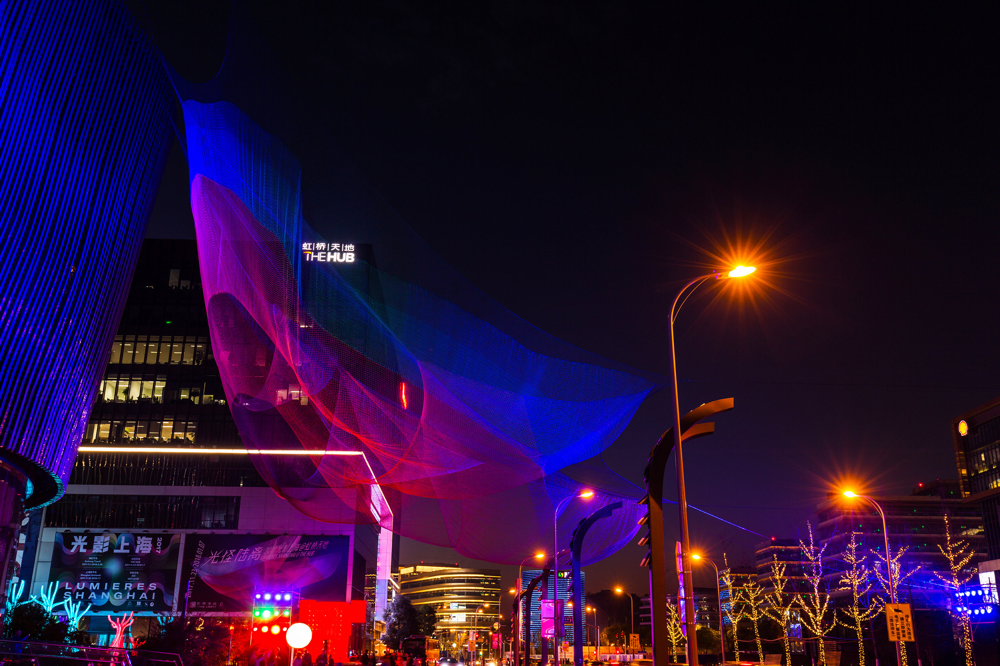
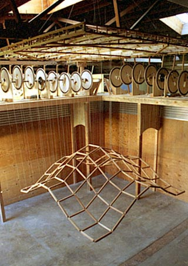

**Final Project Proposal: Interactive Wave** 

I was really inspired by Reuben Margolin's works as he used the logic of math and nature in his pieces. My favorite ones are his wave projects. They're so mezmerizing and surprisingly require precise equations to recreate. 
Since his pieces require the use of exactly measured and cut wood, I'm not sure if I'll have access to those so I'm hoping I may be able to create an interactive wave with the following materials. 

***Material***
- Wooden dowels: to hold the wave
- Mesh cloth: to be the wave
- LED lights: to add color to the wave
- Arduino proximity detecter: for the element of iteraction where your distance will effect the amplitude of the wave
- Motors: to move the dowels to create the waves 
- Strings: for positioning and holding things together 
- Hot glue gun/tape: to secure elements in place

***Process*** 

Inspired by Reuben Margolin's ["Square Wave"](https://www.reubenmargolin.com/waves/square-wave/) and Janet Echelman's [net sculptures](https://www.echelman.com/), I am aiming to create an interactive wave using where the closer a person is to the wave, the more amplified (or higher) the waves become. By using the proximity detector I can map the distance values to the motor rotation angle values and increase and decrease them respectively. I'm hoping I will have time to incorporate the LED's as well where the LED will emit more light as the person gets closer to the wave as well. 

***Sketch***

***Inspiration***

