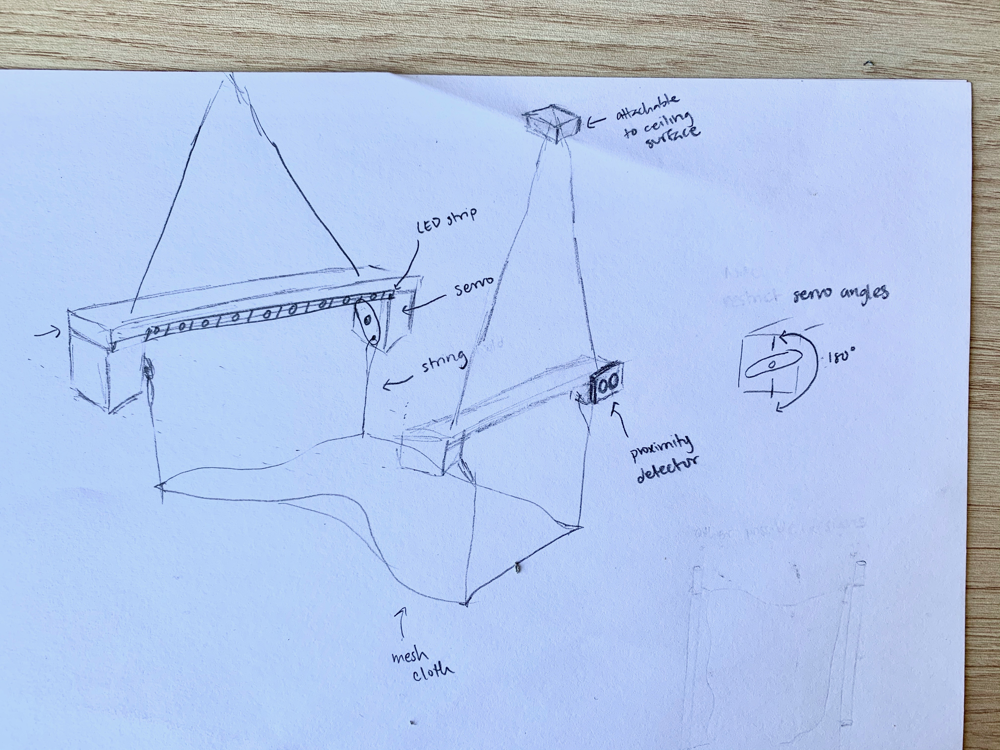
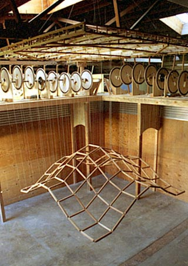
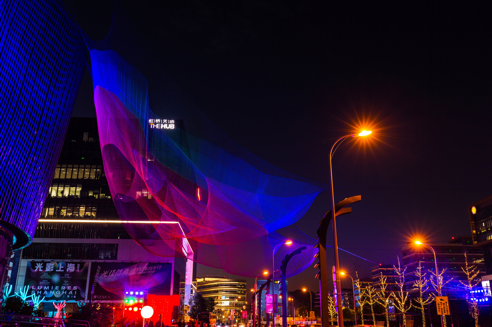

**Final Project Proposal: Interactive Wave**

My project proposal for an Interactive Wave is inspired by Reuben Margolin's "Square Wave" and Janet Echelman's net sculptures. I continue to aim to create an interactive wave using a cloth, servo motors and a proximity detector. The closer a person is to the wave sculpture, the more amplified (or higher) the waves become. By using the proximity detector I can map the distance values to the motor rotation angle values and increase and decrease them respectivelyThe only change I will be making to my previous proposal is the removal of the wooden dowels. I realized that attaching the cloth to a straight dowel would restrict the cloth from being able to freely flow in the air. Instead, I will be tying strings holding the mesh cloth directly to servo motor arms. If I am able to attain 4 servos, each corner of the cloth would hand down from each servo. If not. I will attach two opposite corners to the two servos I have. Inspired by some projects shown during presentations last week, I will be including LED neopixel strips on both bars holding up the entire mechanism of the wave. I look forward to playing around with light settings to see what works best with wave forms. 

***Risks to Consider***
- finding wood or long and thin boxes to encase servos, proximity detector, and breadboard for the interactive wave, it would also have to be strong enough to allow cloth hang with string below: I'd have to experiment with some cardboard boxes laying around at home or cut some styrofoam
- figure out how to extend wiring and power servos in the the other encasing where breadboard is not placed 
- learn how to use the map function on the proximity detector to translate the values to the servos, I believe this will be the longest process of all and will require some research and help from instructors: If I find it hard to use the proximity detector I will test the ultrasonic sensor, I also found this tutorial and will be testing it out ([Servo motor and ultrasonic sensor](https://create.arduino.cc/projecthub/ryujenny3/servo-motor-ultrasonic-sensor-f951fe))

***Material***

- Mesh cloth: to be the wave
- LED neopixels: to add color to the wave
- Arduino: to program and assemble 
- Breadboard: for organization 
- Arduino proximity detecter: for the element of iteraction where your distance will effect the amplitude of the wave
- Motors: to move the strings to create the waves
- Strings: for positioning and holding and moving the mesh cloth
- Hot glue gun/tape: to secure elements in place

***Sketch***

***Inspiration***

Reuben Margolin "Square Wave" 

Janet Echelman "1.26" 

