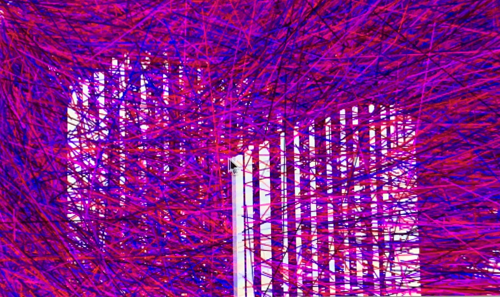
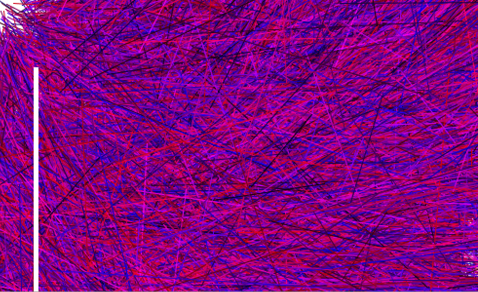

I was inspired by the "Loop Mouse" example by Daniel Shiffman in [*Learning Processing*](http://learningprocessing.com/examples/chp06/example-06-09-loop-mouse)
I really liked the concept of having a trail of bars following the mouse as it hovered over the canvas, so I tried to play around to see what I could do to incorporate more color to the process. 
I wanted to recreate the moving bars to also include a wavy effect so in order to this I used the rect() function to reference the mouseY position to be the maximum height from the bottom of the canvas. 

The initial idea was to have the bars change colors gradiently as you moved the mouse around the canvas, however I had a really hard time trying to figure that out since the distance of the mouse position in Shiffman's example determined the color or opacity of the bar. The distance was only represented in the grey scale. I couldn't figure out how to get a color change by using distance so I resorted to using white bars instead and adding a colored background. 

I thought having a solid colored background was not dynamic enough so I played around with shapes and rotations, in the end I found random rotatations of lines filling the screen to be really interesting. I created a function that would randomly choose points and distances of a line and random colors on the red and blue scales to color the canvas. 

