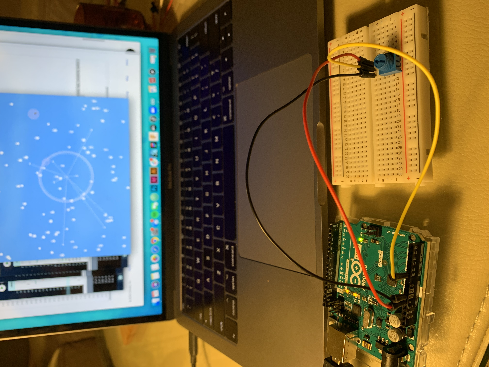
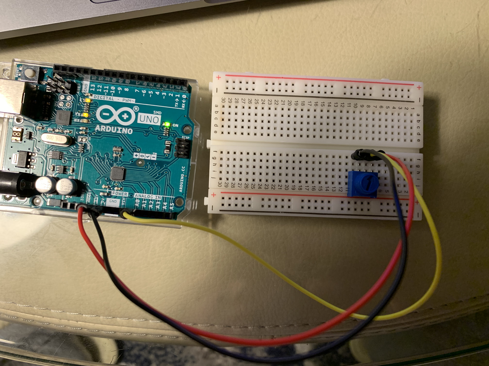
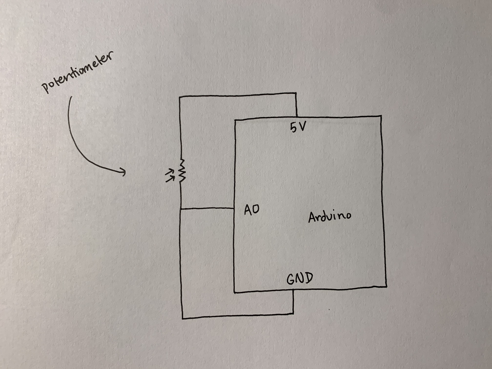

**Incorporating Arduino to Midterm Project**

***Process*** 

For my incorporation of Arduino, I chose to use a potentiometer as an Arduino input to react with my dot catching game. The potentiometer is used to change the size of the catcher circle.
- I initially had trouble figuring out how to connect Arduino and Processing. Using the Graph example in class I referenced the Serial call between Arduino and Processing in the program. Since I was using a USB extension to connect the Arduino it was a bit of a struggle to find the right port to use even having checked on the Arduino program. The port names were long and hard to determine where each name separated in the list of ports printed out in the processing terminal. I ultimately had to test the port out by indexing starting from [0] and ended up successfully finding it at index [3] on the list of ports.
- I tried implementing the potentiometer controlled radius directly into the Catcher class and found that this did not work since Serial was contained in its own class. As a result, I called Serial outside the Catcher class and initiated a new variable to keep track of the radius. To be able to adjust the radius of the catcher, I mapped the min and max values of the potentiator (0, 1023) to the min and max value of the desired catcher circle size (0, 45). Then reassigning the class value r for radius of the catcher to the potentiometer radius variable, it finally worked. 

I had a lot of fun playing around which component of the game to use the potentiometer for. I thought about using switches before to move the catcher instead, but realized this would make it extremely hard to catch the falling dots. I tried implementing the size changing potentiometer onto the timer circle which would shrink throughout the game to indicate the game was over once the circle had shrunk. But this came to complicate the flow of things as the circle would just stay still unless the potentiometer knob was turned. Overall I really enjoyed the implementation of Arduino to Processing, it was nice being able to physically change things on the screen rather than having to go in and find the line of code to change. 

***Project Photos*** 

***Schematic***

***Reference***

[Arduino to Processing - Graph Example](https://www.arduino.cc/en/tutorial/graph) 
