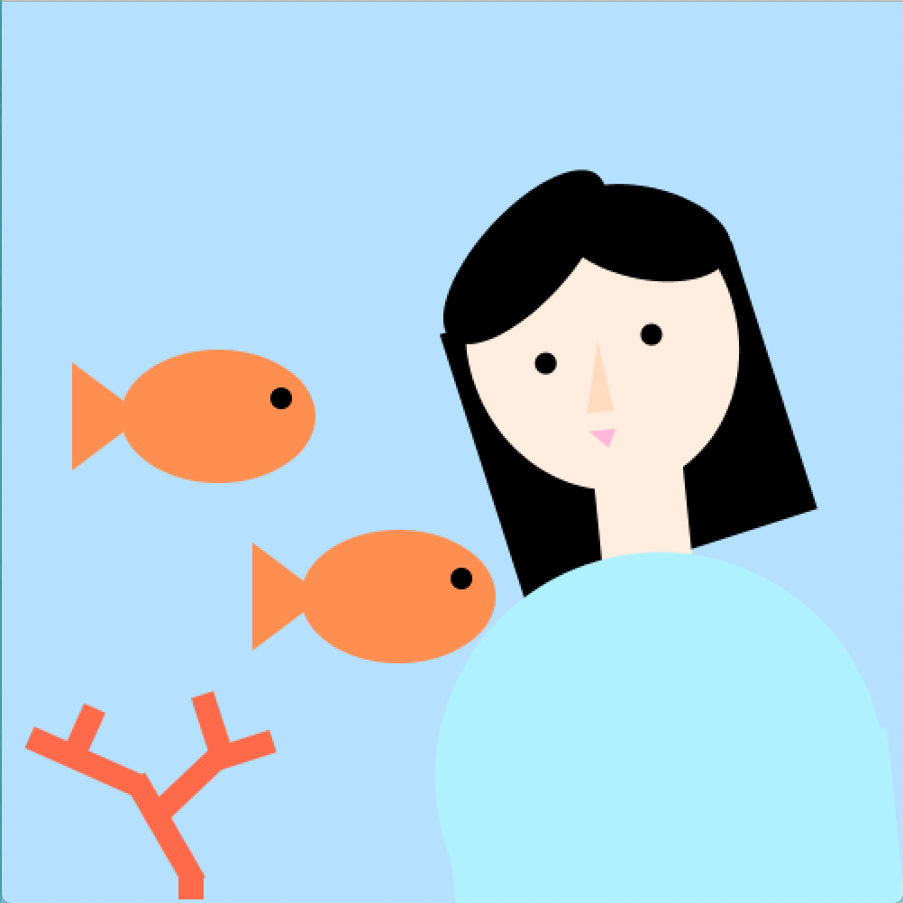

**Portrait**

print ("My portrait is me in the ocean with fishes and coral underwater. 
The chose the ocean to be my environment because underwater life is very important to me. I grew up near the water and have admired ocean creatures ever since I was a kid. Seeing ocean life growing endangered every year, especially corals, has been very distressing and I hope to be able to continue contributing to the conserving ocean life.")

println("While creating my portrait, I found it very difficult to position each piece on the canvas and finding the right rotation as well. I realized that setting a component to be rotated before will rotate the next component as well. I still need to figure out how to stop the rotate command from commanding the following components I don't want to rotate. I learned the importance of hierarcy in creating new components while trying to create the head and body. I wanted some hair to be behind the head and the bangs to be in front of the head, I realized in order to do this I needed to visualize my objects in layers and create them from the bottom layer to the top, while keeping in mind to change my fill commands first according to the color I wanted for each component. To get a better idea of triangle point positions on Processing, I tried using Figma to recreate the triangle I wanted to reference each point of the triangle. I found that this generally worked until I started to use the rotate command. Other than that, I really enjoyed playing around with Processing and loved that I could copy the code and add to the position numbers to recreate another object.")

