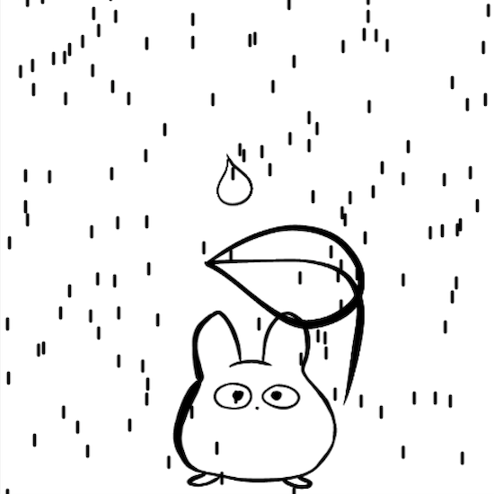

My game is inspired by the Studio Ghibli movie, *Totoro*. I wanted to create a game where the leaf Totoro uses as an umbrella can be moved around by the player to protect "Floof" from the big rain drop. The rainfall was largely taught by [The Code Train](https://www.youtube.com/watch?v=KkyIDI6rQJI). 
To make the rainfall, I learned from The Code Train on how to create a Rain class which would be referred to when each drop of rain is created. To make the leaf umbrella that is controlled by the mouse, I positioned the leaf based on the mouseX and mouseY positions so it can follow the mouse. I then added an interactive giant raindrop made to be blocked by the leaf, preventing it from falling on Floof. I randomzed where the rain drop would fall from after falling off the screen and kept track to see if it fell off the screen by checking to see if the position of the raindrop was further (or greater) than the canvas height. To make the effect of the leaf blocking the giant rain drop I created a if statement to check if the positions of the mouse and the raindrop were in similar positions. This was the most difficult part to figure out. I tried testing different usages of reference points such as trying to use if statements to check if the mouseX position and the position of the raindrop subtracted to equal 0 (same with y). This didn't work so I tried to instead reference the canvas width and height. I found that if the x0 position of the raindrop was less than the distance between the mouseX from the width of the canvas, and if y0 position was less than the distance from the height of the canvas to the mouseY position, this would mean the raindrop and leaf have intersected and therefore the leaf blocked the raindrop. I later realized this only worked on the left half of the canvas, if the raindrop fell from the right side of the canvas, the raindrop would fall past the leaf. I learned that my previous if statement didn't account for the possible negative distance so I resolved this by adding an additional if statement for the right side of the canvas by also checking for x0 positions that were greater than the distance from width to mouseX. I'm still trying to figure out how to expand the region to encompass the entire leaf and not just the position of the mouse. 
Something interesting I found was that no matter where I initiated my rainfall function, the rain still shows up ontop of the character and interactive tools like the leaf and the giant raindrop. I now realize this might have something to do with the additional z position added to the Rain class, this will be something I will look into in my next iteration. 
Overall I had a lot of fun making this game and enjoyed being able to draw my own components to upload and interact with them on processsing. 
