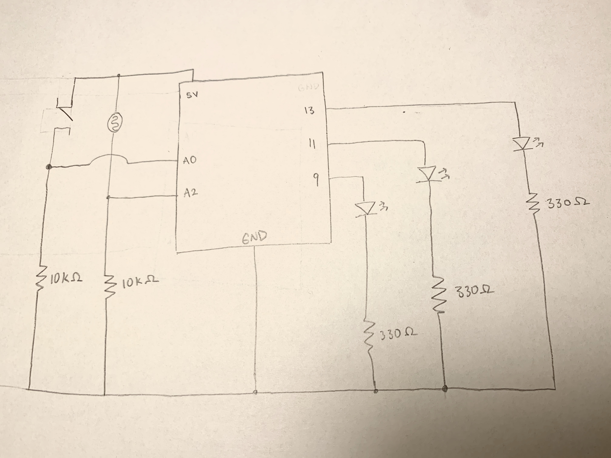
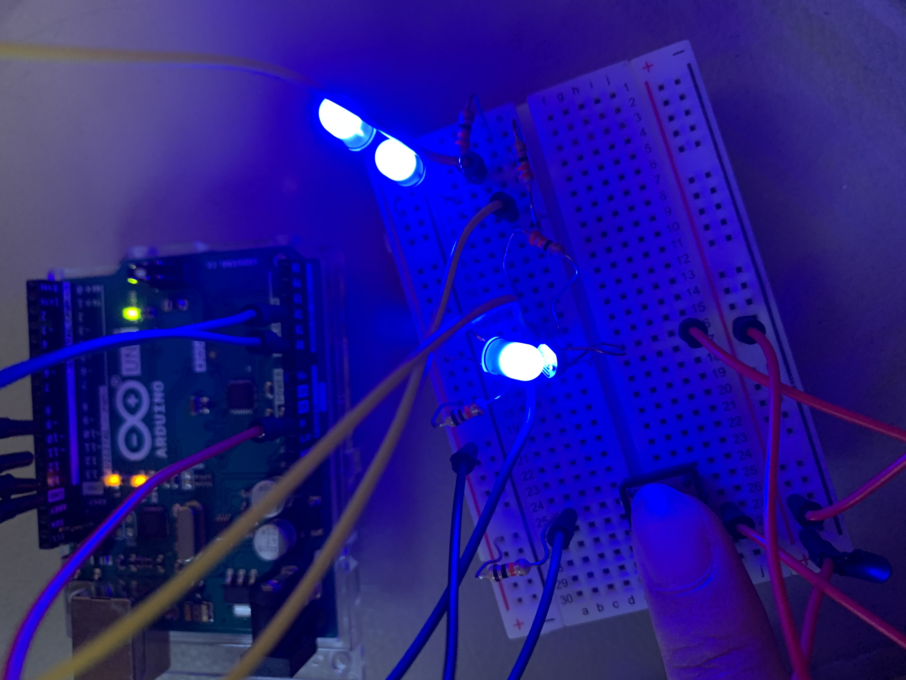

**Light wave using Analog and Digital Sensors** 

For my project, I lined up 3 LED lights to create a mini light wave. A switch (digital sensor) was used to start the wave by lighting the first LED light. A photoresister (analog sensor) was placed next to the first LED light to detect whether it was on or not. If it was on, it would tell the next two LED lights to tun on. 

***Process***

Meticulously placing each wire and component onto the bread board was the most stressful part of this project. It was hard to determine if certain compenents were lined up correctly or fully placed into each hole, however pushing too hard would crumple the wires and mess up the placement. I will definitely be getting some wire cutters for future projects to be more organized. I also learned that the Photoresister's sensor value readings would change based on how far in it was placed into the hole. The more loose it was, the smaller the numbers. The change was drastic: loosely placing the photoresister in would read single digit numbers from 0-8, pushing it in would result in three digit number readings from 400-900. I had to make sure I didn't move the photoresister too much so the numbers I used in my Arduino code would still work and know when to turn the LED lights on and off. Overall, I had a lot of fun testing and experimenting with arduino. It was rewarding to physically change the components and see the effects. I learned a lot about the importance of wire organization too, that is an art in itself. 

***Schematic***

***Project Photo***

