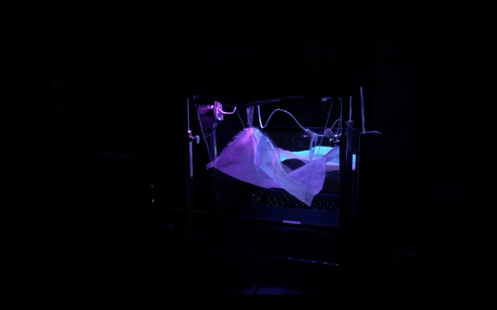
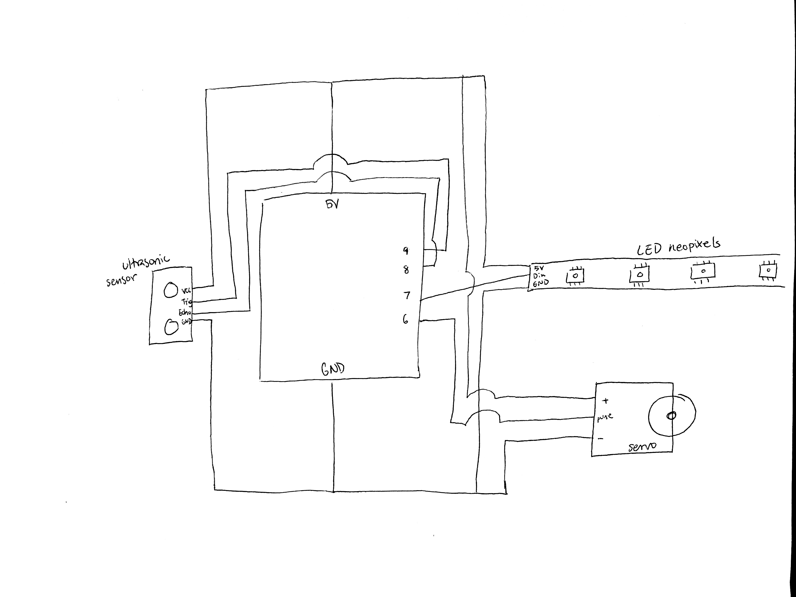
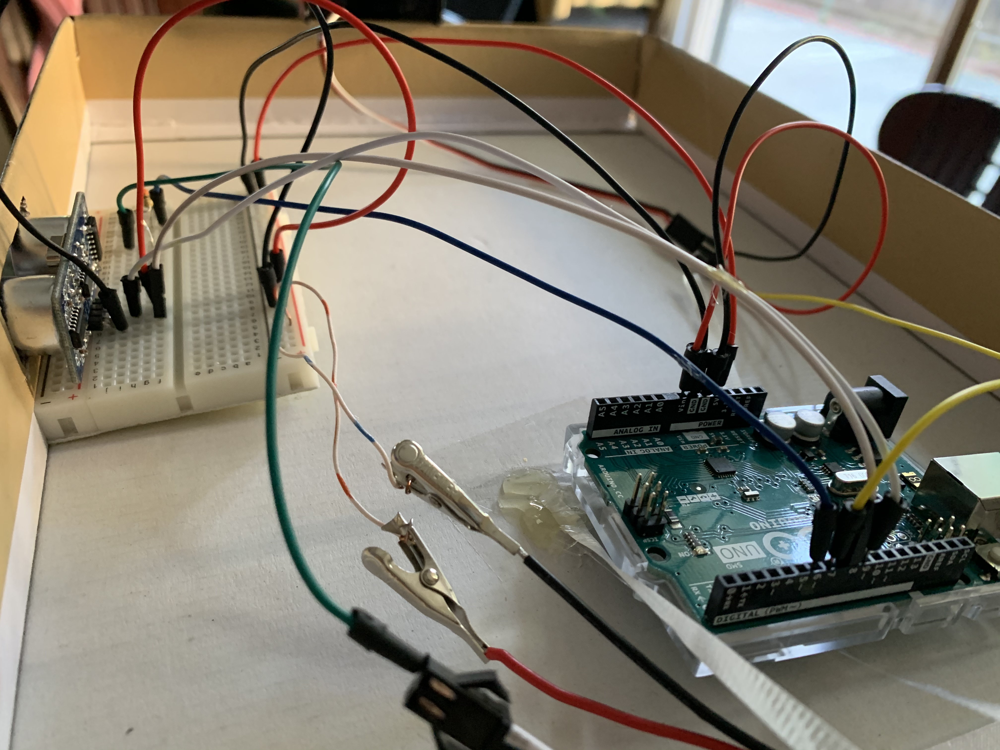
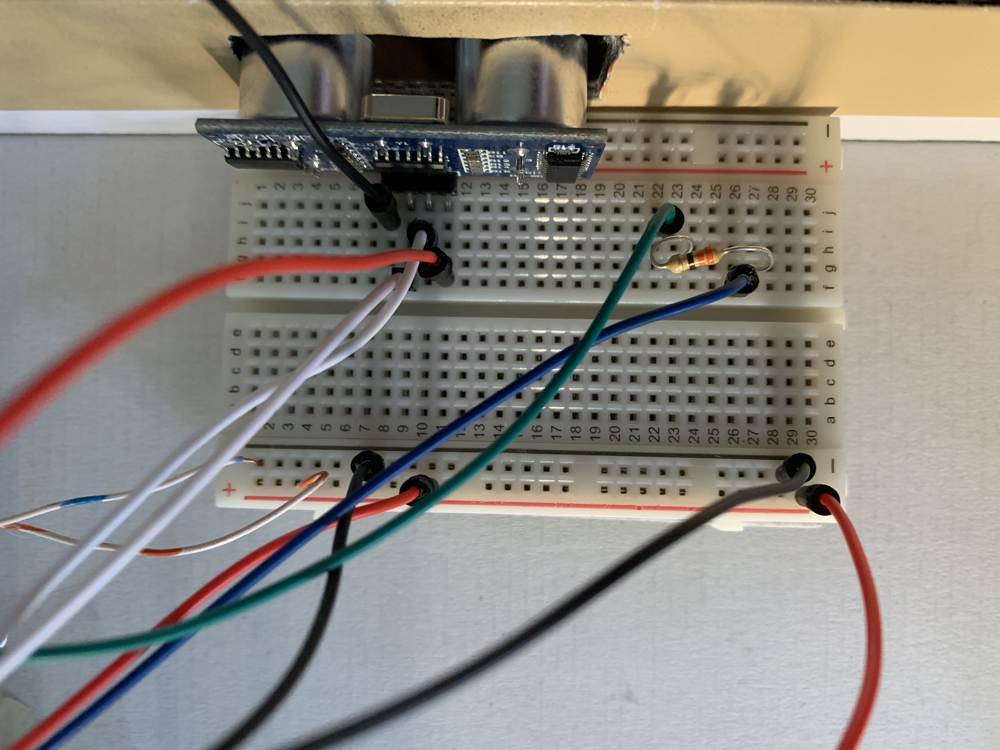
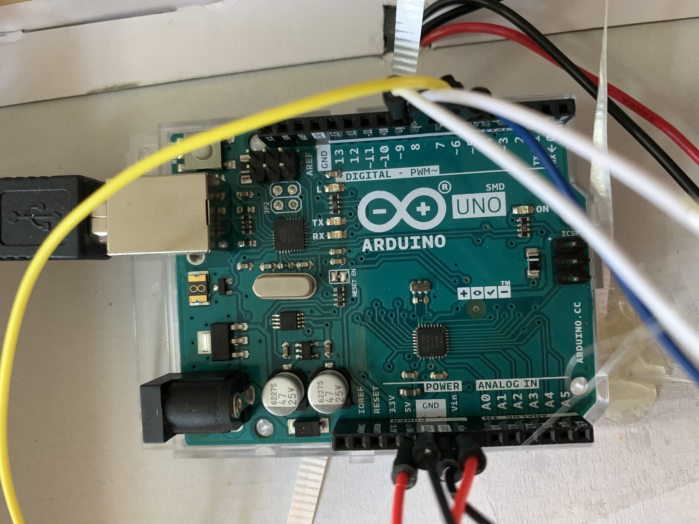

**"Wave"** 

***Project Video:*** [Link](https://www.youtube.com/watch?v=e4VcKBEUEd8&feature=youtu.be)

***Project Description***

This is an interactive kinetic sculpture inspired by ocean waves where the "Wave" is initiated by the perceiver. Once the viewer is detected to have waved towards the sculpture's ultrasonic distance sensor, the servos and LED neopixels are initiated to create wave like motions. A digital wave display on Processing also starts. The motion of the physical wave is geneterated by a curved wire being rotated by the servo. A mesh cloth hung by strings is tied to different curves on the wire to rise and fall in different heights and amplitudes. 

***Material***
- Electronic Components: 
    - arduino uno (microcontroller board)
    - ultrasonic sensor (distance sensor)
    - continuos servo motor (rotates 360 degrees)
    - LED neopixels 
    - breadboard 
    - 11 jumper wires 
    
- Main Sculpture: 
    - mesh cloth 
    - string
    - wire hanger
    
- Support Frame:
    - 4 metal bag displayers (acted as support columns)
    - 4 wooden dowels
    - 14x8x1" box (to hold electronic components in place)
    - 8.7 x 2.25 x 1" box (used to encase servo motor)
    
***Process*** 

- ***Physical Wave***
- Finding that the servos were not able to generate enough motion, I decided to use an extension to assist in making larger ranges of motion by bending curves into a straightened wire hanger. The curves allowed me to tie strings attached to the "Wave" to generate different amplitudes of motion when rotated by the servo. 
- The mesh cloth was a great reflector of light from the LEDs, though its stiffness hindered the smoothness of the wave motion, I found that some sudden rigid and rapid folds from the cloth gave it a more realistic ocean effect as ocean waves sometimes surge vigorously. 
- The strings I used to hang the mesh cloth was a bit finicky. They would tangle and move over to other curves, to prevent them from moving out of place, I used tape to wrap around the string to add structure which prevented any twisting or tangling. The smooth surface of the tape also helped the wire move more fluidly.
- The ultrasonic sensor would at times start malfunctioning as it would start inputting random distances with nothing in front of it. I found that unplugging the sensor then replugging it after a few minutes to allow it to reset its inputs worked most of the time. I also found that surrounding temperature affects the sensor's accuracy. The sensor tends to work better in warmer rooms. Since the ultrasonic detector uses sound waves to detect distance, this makes sense as sound waves travel better in warmer air. 
- The wires attached to the LED neopixels were too thick to attach to the breadboard. To accommadate, I used thinner wires to attach one end to the breadboard and wrap the other end around metal clips to attach the clip to the thick neopixel wires. 

- ***Digital Wave***
- The digital wave was created using the program, Processing. I learned how to use the "noise" function to assign random positions on the screen to generate wave heights from reona396's "Gradiation Wave" on [OpenProcessing](https://www.openprocessing.org/sketch/931254). 
- I ran into some trouble connecting processing with Arduino as the wave display was dependent on the serial readings from the ultrasonic sensor from the Arduino. Processing was not receiving the proper numbers coming from the ultrasonic sensor and hence did not display with the physical wave. To try to resolve this I tried checking and reassigning my Serial port. I later found that Processing has not been storing any values so I implemented an [if statement](https://create.arduino.cc/projecthub/najad/scaling-an-image-in-processing-with-ultrasonic-sensor-1af551) to keep track of arduino's readings and printed them directly into Processing. I was then able to use the stored values to let Processing know when to display the digital wave. 

***Final Thoughts***
- I learned a lot about Arduino and Processing, as well as physical materials. I overestimated the usability of the materials I gathered and ended up spending more time untangling and readjusting according to the material's physical characteristics than programming. I'm glad I had the opportunity to observe and gain more experience with using different materials at hand and was really happy to learn new funtions on Processing and Arduino. I hope to expand on this project in the future to improve the fluidy and flow of the wave at a larger scale. I'd also like to implement more interactive elements to enhance the overall experience of interacting with the wave, almost as if the viewer was Poseidon.. 

***Schematic***
 

***Electronic Components***

