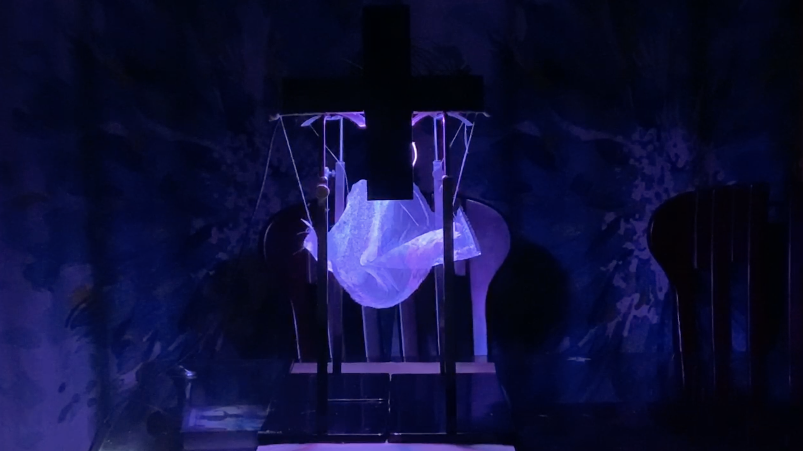

**"Wave"** 

***Project Description***

This is an interactive kinetic sculpture inspired by ocean waves where the "Wave" is initiated by the perceiver. Once the viewer is detected to have pushed towards the sculpture's ultrasonic distance sensor, the servos and LED neopixels are initiated to create wave like motions. The motion is geneterated by a curved wire being rotated by the servo. A mesh cloth hung by strings is tied to different curves on the wire to rise and fall in different heights and amplitudes. 

***Material***
- Electronic Components: 
    - arduino uno (microcontroller board)
    - ultrasonic sensor (distance sensor)
    - continuos servo motor (rotates 360 degrees)
    - LED neopixels 
    - breadboard 
    - 11 jumper wires 
    
- Main Sculpture: 
    - mesh cloth 
    - string
    - wire hanger
    
- Support Frame:
    - 4 metal bag displayers (acted as support columns)
    - 4 wooden dowels
    - 14x8x1" box (to hold electronic components in place)
    - 8.7 x 2.25 x 1" box (used to encase servo motor)
    
***Process*** 

