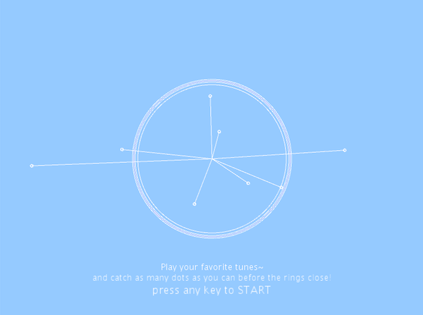

**Midterm Project: Ocil8** 

***Inspiration***
My game was inspired by the artist, Bruno Major's, single album cover for his song ["Nothing"](https://i2.wp.com/coolhunting.com/wp-content/uploads/2019/09/bruno-major-nothing.jpg?fit=1000%2C1000&ssl=1).
The album cover is very minimal as it played with moving circles and lines that I found to be very visually appealing and calming. I wanted to turn the circles and lines (similar to the form of mallets) into audio visualizers in my game with the addition of interactive rain. 

***Process***

Three main rules I used to create the program were functions, conditionals, and for loops.
Functions defined in Classes were used to generate: 
- the oscillating mallets which used for-loops to create multiple mallets at a time. A for loop was also used to continue processing audio input through minim functions so it can detect how big the mallet circles should grow based on the audio input volume and buffer changes. This was the main audio visualizer centered on the screen at all times in and out of game mode. 
- the falling dots (rain), where each dot would be called and created in a for loop.
- a catcher which would interate with the dots by calculating the distance between the dot and where the mouse was positioned. A for loop was also used to make the catcher interactive with audio just like the mallet circles.

Conditionals were used:
- to keep track of what game mode the player was in using booleans to change the mode. In order to be in game mode, a keyPressed() fundtion was used to change the boolean to "true" to initiate the start of the game. If the player was in game mode, this conditional also helped initiate a "timer" like feature represented by a shrinking ring which meant the player had to catch as many dots as possible before the ring shrinks to its smallest form. Once ring has shrunk to a predetermined size (radius 10), the boolean value would be changed to false, signalling game over. I had trouble finding a way to implement a reset after the game was over. Once the rings have shrunk and the game was over, the game was unable to restart. The text for instructions would remain throughout the game as well. To address the text, I created three game modes to keep track of when certain text should appear. It took some testing with conditionals to see keeping track of what made the most sense. I ended up using the game mode booleans and the score. If the score was 0 and game mode was false, this meant the game hasn't started yet so this signalled the start screen which contained intrustions on how to play and start. Once the score is above zero and game mode is false, this meant the player was done playing so the reset screen was signalled to display text containing the player's score and how to reset the game. I realized after the game is over, even if a key was pressed, the conditional which follows doesn't exactly restart from the top set up when in game start mode again. The ring remained at 10 so it was unable to restart since that designated game over. I resolved this by resetting "shrink," the value shrinking the timer ring, to 300 (it's starting size) at the conditional which signalled the player had scored and the game was over so once a key was pressed again, the ring would be back at 300 during game mode. 

***Interesting Finds***
bufferSize 
calculating distance for circles is a lot easier than rectangular shapes compared to last game 
drum had more buffer

Reference: https://natureofcode.com/book/chapter-3-oscillation/
https://thecodingtrain.com/CodingChallenges/004-purplerain.html
http://code.compartmental.net/minim/minim_method_getlinein.html
